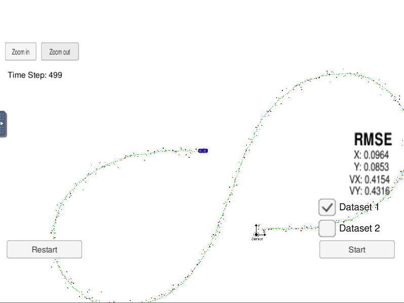
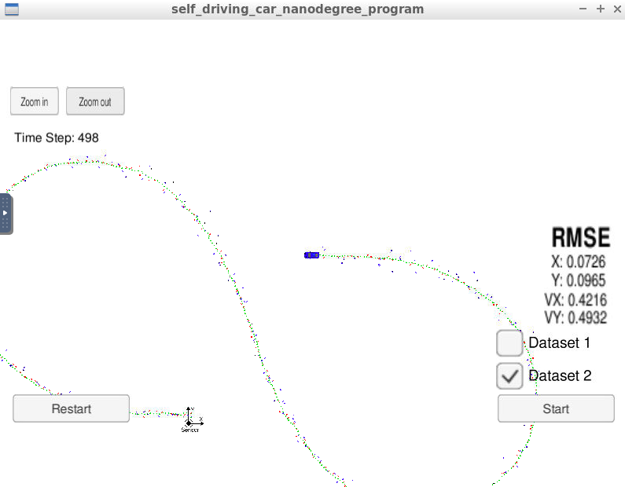
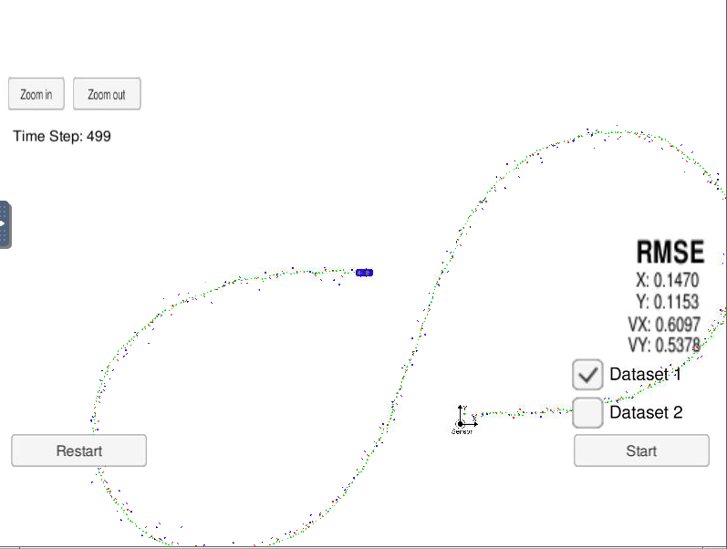
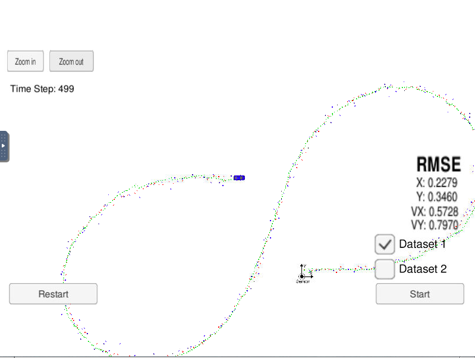
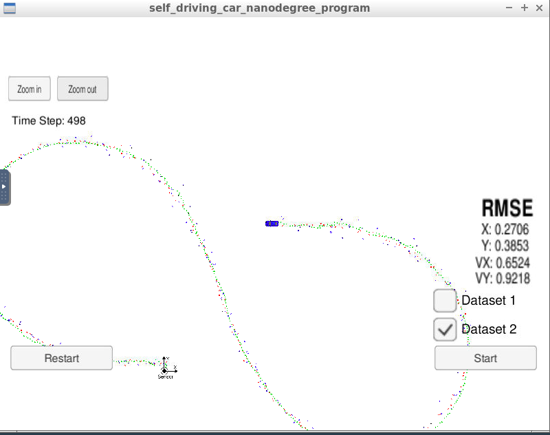

# **Kalman Filter and Sensor Fusion** 

## Writeup

---

**Build a Extended and Linear Kalman Filter Project**

The goals / steps of this project are the following:
* Implement Extended Kalman Filter (EKF) and Kalman Filter (KF) in C++
* Load RADAR and LIDAR data and Track an object using the data
* px, py, vx, and vy RMSE should be less than or equal to the values [.11, .11, 0.52, 0.52]
* Analyze what happens when you turn off radar or lidar

## Rubric Points
### Here I will consider the [rubric points](https://review.udacity.com/#!/rubrics/748/view) individually and describe how I addressed each point in my implementation.  

---
### Writeup / README

#### 1. Implement Extended Kalman Filter (EKF) and Kalman Filter (KF) in C++

Here is a link to my [project code](./src)

#### 2. Load RADAR and LIDAR data and Track an object using the data

Lidar measurements are red circles, radar measurements are blue circles with an arrow pointing in the direction of the observed angle, and estimation markers are green triangles. The video below shows what the simulator looks like when a c++ script is using its Kalman filter to track the object. The simulator provides the script the measured data (either lidar or radar), and the script feeds back the measured estimation marker, and RMSE values from its Kalman filter.

【Dataset 1】

【Dataset 2】

px, py, vx, and vy RMSE were less than or equal to the values [.11, .11, 0.52, 0.52]

#### 3. Analyze what happens when you turn off radar or lidar

------- Only Lidar data -------

【Dataset 1】

【Dataset 2】

------- Only Radar data -------

【Dataset 1】

【Dataset 2】

Results is shown below. RMSEs of using only Radar data were twice of Lidar data.

| RMSE | X | Y | VX | VY |
|:-----------:|:------------:|:------------:|:------------:|:------------:|
| Dataset 1 ( Only Lidar ) | 0.1470 | 0.1153 | 0.6097 | 0.5378 |
| Dataset 1 ( Only Radar ) | 0/2279 | 0.3460 | 0.5728 | 0.7970 |
| Dataset 2 ( Only Lidar ) | 0.1169 | 0.1260 | 0.6227 | 0.6024 |
| Dataset 2 ( Only Radar ) | 0.2706 | 0.3853 | 0.6524 | 0.9218 |

Each noise value in measurement covariance matrix were following. Radar data was more noisy than Lidar data.
So it caused the results of RMSE.

| measuremental noise (variance) | Lidar | Radar |
|:-----------:|:------------:|:------------:|
| px | 0.0225 | - |
| py | 0.0225 | - |
| ro | - | 0.09 |
| phi | - | 0.0009 |
| ro_dot | - | 0.09 |

But compared RSME value of case using only lidar data, RSME of case using lidar and radar (more noisy) data was good.
It showed that sensing by two sensor was more reliabel than only one sensor even though added sensor reliability was low (the sensor data was noisy).