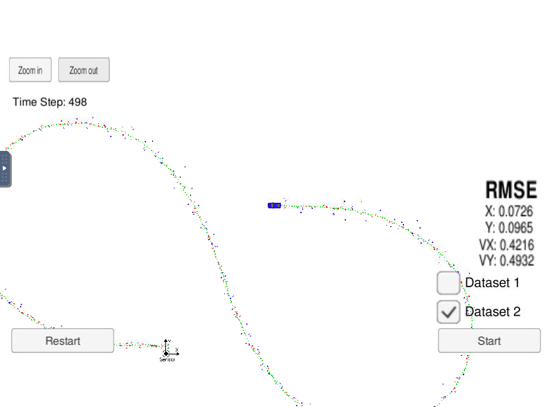
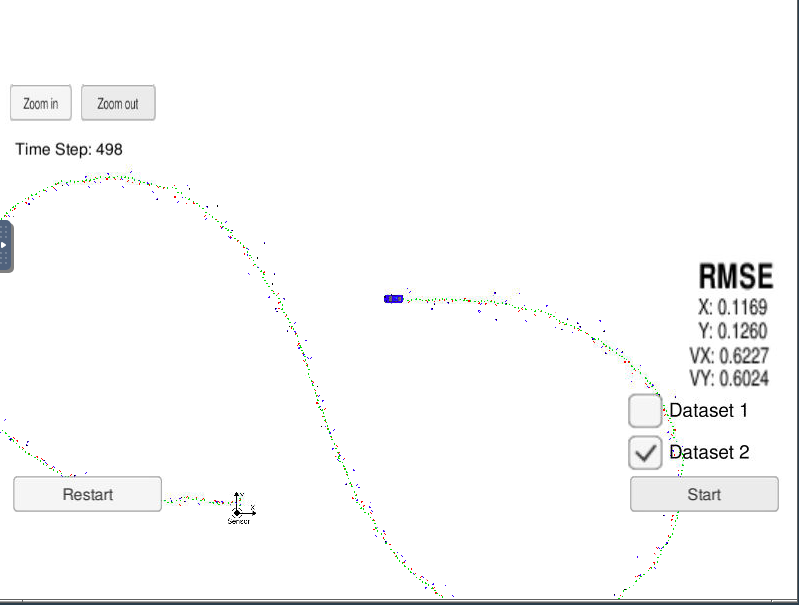

# **Kalman Filter and Sensor Fusion** 

## Writeup

---

**Build a Extended and Linear Kalman Filter Project**

The goals / steps of this project are the following:
* Implement Extended Kalman Filter (EKF) and Kalman Filter (KF) in C++
* Load RADAR and LIDAR data and Track an object using the data
* px, py, vx, and vy RMSE should be less than or equal to the values [.11, .11, 0.52, 0.52]
* Analyze what happens when you turn off radar or lidar

## Rubric Points
### Here I will consider the [rubric points](https://review.udacity.com/#!/rubrics/748/view) individually and describe how I addressed each point in my implementation.  

---
### Writeup / README

#### 1. Implement Extended Kalman Filter (EKF) and Kalman Filter (KF) in C++

Here is a link to my [project code](./src)

#### 2. Load RADAR and LIDAR data and Track an object using the data

【Dataset 1】

【Dataset 2】

px, py, vx, and vy RMSE were less than or equal to the values [.11, .11, 0.52, 0.52]

#### 3. Analyze what happens when you turn off radar or lidar

------- Only Lidar data -------

【Dataset 1】

【Dataset 2】

------- Only Radar data -------

【Dataset 1】

【Dataset 2】

$$ A = \begin{pmatrix}
0 & 0 & 1 \\ 0 & 1 & 0 \\ 1 & 0 & 0
\end{pmatrix}$$

|       | Lidar | Radar |
|:-----------:|:------------:|:------------:|
| px noise | 0.0225 | - |
| py noise | 0.0225 | - |
| ro noise | - | 0.09 |
| phi noise | - | 0.0009 |
| ro_dot noise | - | 0.09 |
